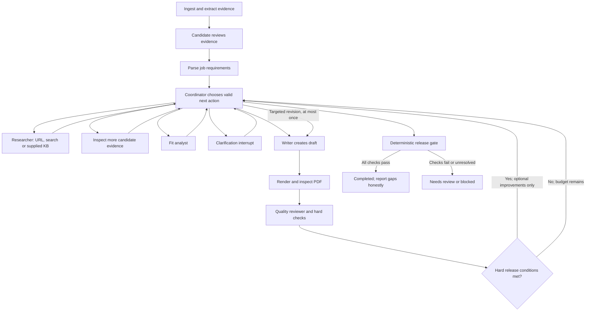

# Architecture and technology decisions

## Stack to implement

| Layer | Choice | Responsibility |
| --- | --- | --- |
| Frontend | Next.js, TypeScript, Tailwind, lucide-react | Static responsive application; use Stitch design |
| Backend | Python 3.11, FastAPI, Uvicorn, python-multipart | Inputs, jobs, status, downloads, application policy |
| Orchestration | LangGraph StateGraph | Typed state, conditional routes, resume after clarification |
| Models | Official google-genai Python SDK | Gemini structured results and supported research tools |
| Schemas | Pydantic v2 | Strict boundary validation; generate OpenAPI |
| Application records | SQLModel + SQLite | Sessions, sources, evidence, runs, events, artifacts |
| Graph checkpoints | SQLite locally; InMemorySaver on Render Free | Development resumption; temporary hosted run state |
| Extraction | python-docx, PyMuPDF, standard text readers | Paragraph/page locators and source text |
| PDF generation | Jinja2 + WeasyPrint | Fixed HTML/CSS template to PDF |
| Verification | Python rules, PyMuPDF, separate Gemini review | Values, support, reading order, page geometry, semantics |
| Tests | pytest, FastAPI/httpx test client, frontend build/type check | Unit, integration and contract checks |
| UI verification | Playwright as a development test tool | Desktop/mobile screenshots and main journey |
| Packaging/hosting | Docker, one Render Free Web Service | Static frontend and Python backend under one origin |
| Source control | Git repository and lockfiles | Reproducible build and submission |

Do not run Playwright/Selenium in the hosted research path. Playwright here is only for development checks. No separate LangChain model wrapper is required: LangGraph nodes can call google-genai directly. Do not add Agents SDK, ADK or CrewAI on top of LangGraph. Respect dependency licenses in the repository; PyMuPDF is AGPL/commercial and must not be described as MIT.

## Deployment shape

```text
Browser: static Next.js app
  | relative /api/* requests, session cookie
  v
FastAPI / one Uvicorn worker
  |-- Run service and bounded asyncio execution
  |-- LangGraph coordinator and specialists
  |-- Gemini adapter (API key server-side)
  |-- Document, evidence, research, rendering and checking tools
  |-- SQLite application records + per-session artifact directory
  `-- Next.js exported files
```

The Next.js app contains one static page at `/` whose client-side views use query parameters such as `?run=<id>&view=results`. This avoids dynamic route generation for runtime run IDs. No server actions, Next.js API routes, runtime SSR or remote image optimization. FastAPI owns the APIs. Poll `/api/runs/{id}` and incremental events every two seconds while active; stop polling on a terminal state. This avoids a second transport dependency and supports reconnecting.

## Graph design



The diagram describes possible paths, not an instruction to revisit every node. Code provides the coordinator only the actions whose prerequisites hold. Require actual research and fit analysis before writing. Rendering and verification always follow writing. `finalize` is not exposed until an evaluated draft exists. The release gate still checks all requirements independently.

Research/evidence specialists can choose which source/tool to inspect based on a question. The coordinator can request evidence for a partially matched requirement, choose a supplied KB after a failed URL, ask for an ownership clarification, or select a specific rewrite after review. Keep these decisions observable. A graph that always runs every node in the same order and ignores findings is insufficient.

Default execution is sequential to respect free API quotas. One active generation job per server is sufficient. Do not make all specialists call Gemini simultaneously. Agent count describes prompt/context boundaries, not parallel processes or extra servers.

## Context and communication

Use a `TypedDict` for graph channels containing JSON-serializable Pydantic-validated records. Each node receives a deliberate subset. The writer gets selected candidate facts, the target requirements, relevant research and allowed writing rules; the reviewer gets the draft and original excerpts, not the writer's self-justification. The coordinator receives compact findings, unresolved issues, source IDs and budgets rather than full transcripts.

Keep extracted source text in the source store; provide exact relevant excerpts when requested through `read_evidence`. Never rely on a lossy summary as the only record of a date or metric. Avoid appending entire conversations to each subsequent agent. Model context, tool results and output size are bounded. Oversized inputs receive an actionable validation error rather than silent truncation.

## Source and evidence rules

The backend assigns source roles: `candidate`, `job`, `company`, or `style`. Candidate evidence can support resume claims. Other roles can guide relevance or phrasing but cannot create candidate facts. A source role supplied inside a document is not trusted.

Persist source ID, content hash, original text, media type, source role and locator. The extractor proposes atomic facts and exact excerpts. Code checks that each normalized quote matches the extracted source at the claimed location. A separate assessment labels support as supported, self_reported, unclear, contradicted or excluded. Candidate approval confirms intended use, not authenticity.

Store exclusions/clarifications separately from original facts. Clarification adds a new user-statement source with its own provenance. Conflicting dates or ownership claims remain conflicts until resolved or excluded. Preserve remaining conflicts in the report.

Each draft statement contains claim IDs, evidence IDs and requirement IDs. Check all three, including that each relation belongs to this run/session and a permissible source role. Check the actual semantic relationship as well as the IDs. A copied bullet from a generic sample is never candidate evidence.

## Tool contracts

All tools return `{status, data, source_refs, warnings, error_code}`; status is `ok`, `partial`, or `error`. Register only named Python functions; never execute a model-supplied shell command or arbitrary URL fetch.

| Tool | Arguments | Output and boundary |
| --- | --- | --- |
| `read_evidence` | question, candidate source IDs | Relevant original excerpts; IDs checked against session |
| `inspect_company_kb` | question, company source IDs | Exact excerpts from supplied company knowledge |
| `research_official_urls` | question, approved URL IDs | Gemini URL Context result and actual retrieval metadata; failure stays failure |
| `search_company` | company, research question | Grounded result, returned citations and queries, only if free capability confirmed |
| `record_research` | findings, source refs | Research record after source-role/URL validation |
| `request_clarification` | question, affected IDs, safe exclusion option | LangGraph interrupt, one focused pending question |
| `validate_draft` | draft ID | Schemas, support/metric checks, role coverage and issue list |
| `render_resume` | validated draft ID, page cap | PDF artifact ID, draft hash; controlled template only |
| `inspect_pdf` | artifact ID | Page count, text/geometry/font checks and normalized extracted text |
| `finalize_package` | draft/evaluation/artifact IDs | Package only when all IDs/hashes and release conditions match |

Implementation can call deterministic tools directly from graph nodes. The researcher and coordinator should make at least some real tool/action choices using Gemini output. Built-in research tools and strict structured output may need separate calls depending on the selected model/API. Put this behind one adapter; do not mix incompatible examples from different SDK endpoints.

## Limits and failure handling

Use defaults from docs/07: at most 18 model attempts per run, 2 research invocations, 3 public company URLs, 2 clarification pauses and 1 rewrite. Limit tool loop iterations and graph transitions too. A retry consumes model-call budget. Retry a transient 429/5xx/timeout once, respecting Retry-After and remaining deadline. A permanent error should fail or use the permitted research fallback immediately.

Set a 10-minute active execution limit excluding time awaiting a human. Refuse repeated tool calls with identical inputs and unchanged state when they add no information. Record every routing action and short reason. The supervisor cannot extend its own budget.

Keep the best passing draft. A passing draft with genuine skills gaps can be released; do not keep revising until every JD requirement is filled. After the one revision, uncertain facts or unreadable PDFs cause needs_review. Never release a stale PDF that predates the final check.

## Research fallback and cost behavior

Start with provided company KB or supplied official URLs. Use Google Search grounding only after the capability probe confirms zero-cost API access. Some Gemini Flash pricing entries list free grounding; availability is model/account dependent. URL Context failures can fall back to the supplied KB or one user clarification. Log provenance as `live_url`, `grounded_search`, `supplied_kb` or `offline_fixture`.

Do not fabricate source quotes from a model summary. URL research without retrievable raw text can retain the provider's citation and retrieval metadata; distinguish it from an exact local excerpt. If official-site ownership cannot be established, label uncertainty and request a supplied company source. Research cannot promote a company technology into a candidate skill.
